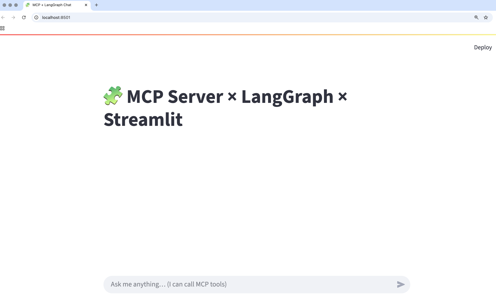

# mcp_github
> **MCP + LangGraph + Streamlit Starter** – A minimal stack to build and use MCP tools (GitHub + greeting) with a LangGraph agent and a Streamlit chat UI.

---

## ✨ What’s inside?
- **MCP server (stdio)** exposing:
  - `greet` – simple hello tool
  - `gh_create_issue` – create GitHub issues
  - `gh_open_pull_request` – open pull requests
  - `gh_list_open_issues` – list repository issues (filters PRs)
- **LangGraph agent** that auto-loads MCP tools and routes calls via `tools_condition`
- **Streamlit UI** for a developer-friendly chat & tool runner
- **Raw MCP client** for quick sanity tests

<p align="center">
  
</p>

---

## 📦 1) Install dependencies

```bash
python -m venv .venv
# macOS/Linux
source .venv/bin/activate
# Windows (PowerShell)
.venv\Scripts\Activate.ps1

pip install -r requirements.txt
```

> If you see `ModuleNotFoundError: No module named 'mcp'`, make sure your virtualenv is **activated** and the dependencies are installed in that environment.

---

## 🔐 2) Configure keys

Copy `.env.example` to `.env` and set required variables.

```bash
cp .env.example .env
```

**.env**
```ini
# OpenAI (used by the agent)
OPENAI_API_KEY=sk-...
# Optional: override model (default: gpt-4o-mini)
OPENAI_MODEL=gpt-4o-mini

# GitHub (used server-side by GH tools)
# For public repos: 'public_repo' scope is enough; for private repos: 'repo' scope.
GITHUB_TOKEN=ghp_your_token_here
```

---

## ▶️ 3) Run the MCP server (optional)

You can run it directly if you want to test the server alone:

```bash
python mcp_server/mcp_server.py
```

> The client/agent/Streamlit scripts will **auto-spawn** the server via stdio if it isn’t already running.

---

## 🧪 4) Test the raw MCP client

```bash
python client/client.py
```

What it does:
- Lists available tools
- Calls `greet`
- Lists open issues
- (Optionally) creates an issue

Expected console sample:
```
 // tools //
 - greet
 - gh_create_issue
 - gh_open_pull_request
 - gh_list_open_issues

 // greet //
 Hello, Rohit! 👋

 // gh_list_open_issues //
 [ ... JSON list of issues ... ]

 // gh_create_issue //
 {
   "number": 42,
   "url": "https://github.com/rohit3773/mcp_github/issues/42",
   "id": 1234567890,
   "state": "open"
 }
```

---

## 🤖 5) Run the LangGraph chat loop

```bash
python agent/run_agent.py
```

Example prompts you can try:
- `Say hello to Rohit using the greet tool.`
- `List open issues in rohit3773/mcp_github (limit 20).`
- `Create a GitHub issue in rohit3773/mcp_github titled "Dark mode theme breaks on settings page" with body "When switching to dark mode, some text remains black and becomes invisible" and labels ui, theme.`

> The agent binds MCP tools dynamically and routes using `tools_condition`. Any new MCP tool you add to the server becomes immediately usable by the agent.

---

## 🖥️ 6) Launch the Streamlit UI

```bash
streamlit run ui/streamlit_app.py
```
Open the URL shown (e.g., http://localhost:8501).

### Streamlit UI screenshots

> Put these files under `docs/screenshots/` to render in this README.
>
> - `docs/screenshots/streamlit_home.png` – Chat landing screen  
> - `docs/screenshots/streamlit_tool_call.png` – When the agent calls an MCP tool  
> - `docs/screenshots/streamlit_issue_list.png` – Successful GitHub issue creation

<p align="center">
  
</p>

---

## 🧱 Project structure

```
.
├─ agent/
│  ├─ run_agent.py            # LangGraph loop (loads MCP tools via stdio)
├─ client/
│  ├─ client.py               # Raw MCP client for quick tests
├─ mcp_server/
│  ├─ mcp_server.py           # MCP server (greet + GitHub tools)
├─ tests/
│  ├─ test_sample             # Examples to test
├─ streamlit_app.py           # Streamlit chat UI
├─ docs/
│  └─ screenshots/            # Place images used in README
├─ .env.example
├─ requirements.txt
└─ README.md
```

---

## 🧩 MCP server – tools available

- `greet(name: str) -> str`  
  Returns a friendly greeting.

- `gh_create_issue(owner, repo, title, body="", labels=None, assignees=None) -> json`  
  Creates a GitHub issue. Requires `GITHUB_TOKEN` in server `.env`.

- `gh_open_pull_request(owner, repo, head, base, title, body="", draft=False, maintainer_can_modify=True) -> json`  
  Opens a pull request from `head` into `base`.

- `gh_list_open_issues(owner, repo, labels=None, assignee=None, limit=50) -> json[]`  
  Lists **open issues** (filters out PRs). Supports `labels`, `assignee` (or `"*"`), and `limit` (max 100).

**Notes**
- Tools use `https://api.github.com` with `Accept: application/vnd.github+json` and API version `2022-11-28`.
- Errors bubble as helpful messages including HTTP status and error payload.

---

## 🏗️ Architecture (high-level)

```
User ↔ Streamlit UI
           │
           ▼
       LangGraph Agent
     (ChatOpenAI + tools_condition)
           │ (stdio)
           ▼
        MCP Server
  (greet + GitHub tools)
           │
           ▼
         GitHub API
```

---

## 🧪 Example: cURL sanity check for issues (optional)

```bash
curl -H "Authorization: Bearer $GITHUB_TOKEN"      -H "Accept: application/vnd.github+json"      "https://api.github.com/repos/rohit3773/mcp_github/issues?state=open&per_page=10"
```

> The GitHub `/issues` endpoint returns both issues and PRs—your MCP server filters out PRs automatically.

---

## 💡 Usage examples (copy-paste)

**Create issues**
- “Create a GitHub issue in rohit3773/mcp_github titled ‘Dark mode theme breaks on settings page’ with the body ‘When switching to dark mode, some text remains black and becomes invisible’ and add labels ui and theme.”
- “Open a new issue in rohit3773/mcp_github titled ‘API timeout on login’ with the body ‘Login API intermittently returns 504 Gateway Timeout after 30s’ and add labels backend and bug.”
- “In the repo rohit3773/mcp_github, create an issue titled ‘Update documentation for installation’ with the body ‘Docs don’t mention Python 3.11 requirement’ and add label documentation.”

**Open PRs**
- “Open a pull request in rohit3773/mcp_github from branch feature/add-logging into main titled ‘Add structured logging’ with the body ‘Implements JSON logging across all services.’ Mark it as draft.”
- “Create a PR in rohit3773/mcp_github from branch fix/login-bug into develop titled ‘Fix login redirect bug’ with the body ‘Resolves issue where login redirects twice after success.’”

**Mixed**
- “Please create a GitHub issue in rohit3773/mcp_github called ‘Refactor utils.py’ with the body ‘utils.py has grown too large, needs splitting into modules.’ Add label refactor.”
- “Now open a pull request from branch refactor-utils into main titled ‘Refactor utils.py into modules’ with the body ‘Splits helpers into multiple files as discussed.’”

**Resource + Tool combo (if you surface greet in UI)**
- “Say hello to Alice and then create an issue in rohit3773/mcp_github titled ‘Welcome message typo’ with the body ‘Greeting says Hello, Alicee instead of Hello, Alice.’ Label it bug.”

---

## 🛠️ Troubleshooting

- **`ModuleNotFoundError: No module named 'mcp'`**  
  Ensure the correct virtualenv is active and run `pip install -r requirements.txt` (or `uv pip install -r requirements.txt`).

- **`GITHUB_TOKEN not set. Put it in your .env`**  
  Add `GITHUB_TOKEN` to the server’s `.env` and restart. For private repos, ensure the token has `repo` scope.

- **GitHub API 404 for repo or permissions**  
  Check the repo name (e.g., `mcp_github` **with an ‘s’**) and token scopes. Verify visibility of the repo.

- **Rate limiting**  
  Unauthenticated requests are rate-limited—always use `GITHUB_TOKEN` on the server.

- **Windows activation**  
  Use PowerShell: `.venv\Scripts\Activate.ps1` (or `cmd.exe`: `.venv\Scripts\activate.bat`).

---

## 📄 License
MIT (or your preferred license). Update `LICENSE` accordingly.

---

## 🙌 Credits
- MCP Python SDK
- LangGraph
- Streamlit
- GitHub REST API
